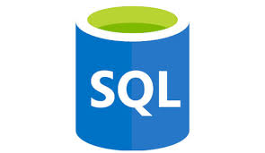

# Azure Data Pipeline Documentation

<div style="display: flex; justify-content: center; align-items: center; flex-wrap: wrap;">
  
  
  
  
  
  
  
</div>  

**Version**: 1.0  
**Date**: 17 Oct 2024  

## Team Members
- **Bassel Ashraf Ahmed** – Data Factory Implementation  
- **Omar Hussein Mohamed (Me)** – Merging and Querying SQL Tables  
- **Ahmed Tarek Mohamed** – Regression Analysis  
- **Mohamed Tarek Abdelsattar** – Power BI Dashboard Insights  

---

---

## Table of Contents  

1. [Overview](#overview)  
2. [Prerequisites](#prerequisites)  
3. [Infrastructure Setup](#3-infrastructure-setup)  
   - [3.1 Azure Resources](#31-azure-resources)  
   - [3.2 SQL Database Schema](#32-sql-database-schema)  
4. [Data Ingestion and Cleaning](#4-data-ingestion-and-cleaning)  
   - [4.1 Data Ingestion](#41-data-ingestion)  
   - [4.2 Data Cleaning](#42-data-cleaning)  
5. [Exploratory Data Analysis (EDA)](#5-exploratory-data-analysis-eda)  
   - [5.1 Top 10 Countries by Transactions](#51-top-10-countries-by-transactions)  
   - [5.2 Top 10 Most Sold Products](#52-top-10-most-sold-products)  
   - [5.3 Monthly Sales Trend](#53-monthly-sales-trend)  
   - [5.4 Total Price Distribution](#54-total-price-distribution)  
6. [Data Factory Implementation](#6-data-factory-implementation)  
   - [6.1 Key Components](#61-key-components)  
   - [6.2 Execution Order](#62-execution-order)  
7. [Merging and Querying SQL Tables](#7-merging-and-querying-sql-tables)  
   - [7.1 SQL Schema](#71-sql-schema)  
   - [7.2 Example Queries](#72-example-queries)  
8. [Summary](#8-summary)  
9. [Contributions](#9-contributions)  

---

## Overview

This project outlines the design, implementation, and key insights from a data pipeline that:
- Ingests CSV data into an Azure SQL database.
- Merges SQL tables for efficient querying.
- Applies regression analysis for predictive insights.
- Visualizes the results using a Power BI dashboard.

---

## Prerequisites

Before setting up the pipeline, ensure the following:

- **Azure Subscription**: An active subscription for provisioning Azure resources (SQL Database, Data Factory, etc.).
- **Power BI Account**: Required for creating dashboards.
- **Python Environment**: Install the following libraries for regression analysis:
  - `numpy`
  - `pandas`
  - `sklearn`
  - `matplotlib`
- **CSV Datasets**: Ensure access to datasets (`Customers.csv`, `Products.csv`, `Invoices.csv`, `InvoiceItems.csv`).
- **SQL Management Tools**: Use Azure Data Studio or SQL Server Management Studio (SSMS).

---

## 1. Infrastructure Setup

Provisioned resources in Azure:
1. **Resource Group**: Groups all related Azure services.
2. **SQL Server**: Hosts the Azure SQL database.
3. **SQL Database**: Contains the following tables:
   - `Customers`: Customer information (`CustomerID`, `Country`).
   - `Products`: Product details (`StockCode`, `Description`, `UnitPrice`).
   - `Invoices`: Invoice records (`InvoiceNo`, `CustomerID`, `InvoiceDate`).
   - `InvoiceItems`: Items in each invoice (`InvoiceNo`, `StockCode`, `Quantity`, `TotalPrice`).

---

## 2. Data Ingestion and Cleaning

### 2.1 Data Ingestion
Load datasets using Python:

```python
import pandas as pd

# Load the dataset
data = pd.read_csv("D:/Microsoft Data Engineer/Graduation Project/online_retail.csv")
print(data.head())
```

### 2.2 Data Cleaning
#### 2.2.1 Handling Missing Values
```python
data_clean = data.dropna(subset=['CustomerID'])
```

#### 2.2.2 Removing Duplicates
```python
data_clean = data_clean.drop_duplicates()
```

#### 2.2.3 Handling Incorrect or Negative Quantities
```python
data_clean = data_clean[data_clean['Quantity'] > 0]
```

#### 2.2.4 Handling Invalid Stock Codes
```python
invalid_stock_codes = ['POST', 'D', 'M', 'DOT', 'BANK CHARGES', 'PADS', 'CRUK']
data_clean = data_clean[~data_clean['StockCode'].isin(invalid_stock_codes)]
```

#### 2.3 Final Steps
- Convert `InvoiceDate` to `datetime`.
- Calculate `TotalPrice`.
- Export cleaned data to a CSV file.

```python
data_clean.to_csv('cleaned_online_retail.csv', index=False)
```

---

## 3. Exploratory Data Analysis (EDA)

### 3.1 Top 10 Countries by Transactions
```python
sns.barplot(x=country_counts.values, y=country_counts.index, palette='viridis')
```

### 3.2 Top 10 Most Sold Products
```python
sns.barplot(x=top_10_products.values, y=top_10_products.index, palette='Blues_r')
```

### 3.3 Monthly Sales Trend
```python
sns.lineplot(x='YearMonth', y='TotalPrice', data=monthly_sales, marker='o')
```

### 3.4 Total Price Distribution
```python
sns.violinplot(x=data['TotalPrice'], color='lightblue')
```

---

## 4. Data Factory Implementation

### Key Components
1. **Linked Services**: Connections to CSV files and SQL database.
2. **Datasets**: Represents each CSV file and corresponding SQL table.
3. **Data Flows**: Manages data ingestion into SQL tables.
4. **Pipeline**: Orchestrates data flow execution.

### Execution Order
1. `customers1`: Loads the Customers table.
2. `products1`: Loads the Products table.
3. `invoices1`: Loads the Invoices table.
4. `invoiceitems1`: Loads the InvoiceItems table.

---

## 5. Merging and Querying SQL Tables

### SQL Schema
```sql
CREATE TABLE SalesSummary (
    CustomerID INT,
    Country VARCHAR(100),
    InvoiceNo INT,
    InvoiceDate DATETIME,
    StockCode VARCHAR(100),
    Description VARCHAR(255),
    UnitPrice DECIMAL(10, 2),
    Quantity INT,
    TotalPrice DECIMAL(10, 2),
    TotalItemPrice AS (Quantity * UnitPrice)
);
```

### Example Queries
1. **Total Sales per Customer**:
   ```sql
   SELECT CustomerID, Country, SUM(TotalItemPrice) AS TotalSales
   FROM SalesSummary
   GROUP BY CustomerID, Country;
   ```
2. **Top-Selling Products**:
   ```sql
   SELECT StockCode, Description, SUM(Quantity) AS TotalQuantitySold
   FROM SalesSummary
   GROUP BY StockCode, Description
   ORDER BY TotalQuantitySold DESC;
   ```

---

## Summary

- **Top Countries**: The UK leads in transaction count.
- **Top Products**: Popular items include decor and utility products.
- **Sales Trends**: Seasonal fluctuations with an upward trend.
- **Price Distribution**: Most transactions are in a lower price range.

---

**Contributions**:  
This project was a collaborative effort by the team, showcasing expertise in Azure Data Factory, SQL, regression analysis, and Power BI.
